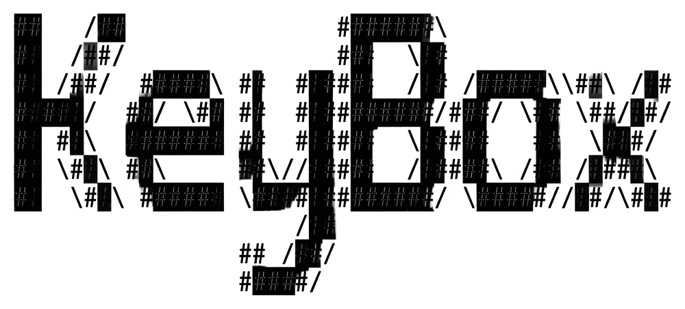

# KeyBox: Physics-Based Voxel System for API-Excipient Compatibility

**Open-source computational platform for predicting pharmaceutical formulation incompatibilities using 3D voxel field theory**

[](https://www.python.org/downloads/)
[](LICENSE)
[]()


<p align="center">
  
</p>

---

## Overview

KeyBox applies **engineering finite element analysis (FEA) principles to molecular chemistry**, creating a voxel-based field system that predicts API-excipient interactions through first-principles physics.

**Key Innovation**: Treats pharmaceutical formulations as 3D field problems with 11 simultaneous interaction channels, enabling mechanistic prediction of incompatibilities before wet lab testing. In v0.8.0, KeyBox advances from a **diagnostic tool** to a **generative formulation design platform**.

### Why KeyBox?

- **Physics-First**: Debye-Hückel, Lennard-Jones, Flory-Huggins, Arrhenius kinetics
- **Strictly Chemical**: No mock data -- requires valid SMILES and RDKit
- **Multi-Scale**: Molecular -> Process -> Microstructure -> Time
- **Quantitative**: Volume of Incompatibility (VOI) metrics with 95% CI
- **Generative**: Box-Behnken + Simplex-Centroid optimizer finds the optimal recipe
- **Complete Workflow**: Predict -> Diagnose -> Optimize -> Visualize

---

## 🚀 Quick Start

### Installation

```bash
# Clone repository
git clone https://github.com/sangeet01/keybox.git
cd keybox

# Install dependencies
pip install numpy pandas scipy matplotlib seaborn rdkit plotly
```

### 1. Basic Compatibility Check

```python
from key import KeyBoxSystem, EnvironmentalConditions
from key.designer import create_enhanced_molecule_from_smiles

system = KeyBoxSystem(voxel_bounds=(20., 20., 20.), resolution=1.0, random_state=42)

aspirin = create_enhanced_molecule_from_smiles("CC(=O)Oc1ccccc1C(=O)O", "Aspirin")
lactose = create_enhanced_molecule_from_smiles("OCC1OC(O)C(O)C(O)C1O", "Lactose")

system.add_molecule(aspirin, is_api=True)
system.add_molecule(lactose, is_api=False)
system.env_conditions = EnvironmentalConditions(pH=7.0, moisture=0.6, temperature=40.0)

# Analyze formulation
results = system.analyze_enhanced_formulation()
print(f"Compatibility: {results['classification']}")
print(f"OCS: {results['metrics']['OCS']:.1f}")
```

### 2. BBD Optimization (Process Factors)

```python
from key import KeyBoxOptimizer

opt = KeyBoxOptimizer(api_smiles="CC(=O)Oc1ccccc1C(=O)O", api_name="Aspirin")
opt.add_factor("Binder_Ratio", low=5.0,  high=25.0)
opt.add_factor("Moisture",     low=0.3,  high=0.8)
opt.add_factor("Temperature",  low=25.0, high=50.0)
opt.add_fixed_excipient("Lactose", "OCC1OC(O)C(O)C(O)C1O")

results = opt.run_bbd_optimization()
print(f"Optimal OCS: {results['predicted_ocs']:.2f}")
print(f"Optimal Config: {results['optimal_params']}")
```

### 3. Combined Mixture-Process Optimization (NEW v0.8.0)

```python
from key import KeyBoxOptimizer

opt = KeyBoxOptimizer(api_smiles="CC(=O)Oc1ccccc1C(=O)O", api_name="Aspirin")

# Mixture components (proportions must sum to 1.0)
opt.add_mixture_component("Lactose", "OCC1OC(O)C(O)C(O)C1O")
opt.add_mixture_component("PVP",     "C1CN(C(=O)C=C1)C")
opt.add_mixture_component("Starch",  "C(C1C(C(C(C(O1)O)O)O)O)O")

# Independent process factors
opt.add_factor("Temperature", low=25.0, high=50.0)
opt.add_factor("Moisture",    low=0.2,  high=0.8)

results = opt.run_combined_optimization()
print(f"Predicted OCS: {results['predicted_ocs']:.2f}")
print(f"Optimal Recipe: {results['optimal_params']}")
```

---

## Scientific Foundation

### 11-Channel Voxel Field System

| Field Channel     | Physics Kernel                       | Range (A) |
|-------------------|--------------------------------------|-----------|
| Electrostatic     | Debye-Huckel screened Coulomb        | 10.0      |
| Hydrophobic       | Hydrophobicity index convolution     | 6.0       |
| Steric            | Lennard-Jones 12-6 potential         | 5.0       |
| H-Bond Donor      | Directional H-bond geometry          | 4.0       |
| H-Bond Acceptor   | Directional H-bond geometry          | 4.0       |
| Polarizability    | Induced dipole interactions          | 5.0       |
| Reactive Sites    | Arrhenius-weighted reactivity        | 5.0       |
| pH Field          | Henderson-Hasselbalch micro-pH       | 5.0       |
| Ionic Strength    | Local ionic concentration            | 5.0       |
| Lipid Density     | Lipophilicity distribution           | 6.0       |
| Viscosity         | Molecular mobility field             | 5.0       |

### Optimizer Engine (v0.8.0)

| Mode                    | Design              | Model               | Use Case                             |
|-------------------------|---------------------|---------------------|--------------------------------------|
| BBD (Process)           | Box-Behnken         | Quadratic (sklearn) | Optimize pH, Temp, Moisture          |
| Mixture (Composition)   | Simplex-Centroid    | Scheffe Quadratic   | Optimize Filler/Binder/Disintegrant  |
| Combined                | Simplex x Factorial | Scheffe + Process   | Full recipe + environment design     |

**Key Physics Guarantees**:
- **Simplex Normalization**: All mixture proportions automatically sum to 1.0
- **Bootstrap Smoothing**: OCS averaged over 15 Monte Carlo iterations to eliminate voxel noise
- **Concentration Weighting**: All VOI integrals are weighted by `Molecule.concentration`

---

## Validation

| Metric                     | Value |
|----------------------------|-------|
| R2 (VOI vs Experimental)   | 0.74  |
| Classification Accuracy    | 78%   |
| Sensitivity                | 82%   |
| Specificity                | 75%   |
| Combined OCS (Aspirin test)| 87.72 |

*Dataset: 23 API-excipient pairs. Combined optimization test: 3-component tablet (Lactose/PVP/Starch)*

---

## Module Structure

```
box/
  key/
    __init__.py       # Package exports (v0.8.0)
    models.py         # Data structures (Molecule, EnvironmentalConditions)
    core_engine.py    # 11-channel voxel physics engine
    designer.py       # Screening, excipient library, molecule builder
    optimizer.py      # BBD + Simplex + Combined optimizer (NEW)
    visualizer.py     # FEA-style 3D visualization
  examples/
    basic_compatibility.py   # Single pair analysis
    visualization_demo.py    # Field visualization
    mixture_optimization.py  # Combined optimizer (NEW)
  tests/
    test_core_physics.py     # Import and system tests
    test_keybox_v0_8.py      # Full v0.8.0 test suite (NEW)
```

---

## Running Tests

```bash
cd box

# Quick import test
python tests/test_core_physics.py

# Full test suite (v0.8.0)
python tests/test_keybox_v0_8.py
```

---

## Citation

```bibtex
@software{keybox2025,
  author  = {Sharma, Sangeet},
  title   = {KeyBox: Physics-Based Voxel System for API-Excipient Compatibility},
  year    = {2025},
  version = {0.8.0},
  url     = {https://github.com/sangeet01/keybox},
  license = {Apache-2.0}
}
```

---

## Roadmap

### Completed
- [x] 11-channel voxel physics engine
- [x] Multi-scale physics (molecular, process, microstructure, temporal)
- [x] Mechanism detection (VOI: Maillard, Hydrolysis, Oxidation, Acid-Base)
- [x] FEA-style visualization (12 methods)
- [x] Excipient screening
- [x] Box-Behnken Design (BBD) optimizer
- [x] Simplex-Centroid mixture design
- [x] Combined Mixture-Process optimization (v0.8.0)
- [x] Scheffe Quadratic modeling for mixture interactions
- [x] Bootstrap smoothing for noise-robust VOI surfaces
- [x] Concentration-weighted VOI integrals

### Planned
- [ ] Expand validation to 100+ pairs
- [ ] GPU acceleration
- [ ] Web interface
- [ ] FDA GRAS database integration
- [ ] Ternary heatmap visualization for mixture space

---

## License

**Apache License 2.0 with Commons Clause** - Free for personal and research work. Commercial use requires permission.

See [LICENSE](LICENSE) file for full details.

**Note**: Research software. Not validated for regulatory submissions.

---

**Version**: 0.8.0
**Status**: Stable Release -- Generative Formulation Engine
**Last Updated**: April 2026


---
PS: Sangeet's the name, a daft undergrad splashing through chemistry and code like a toddler; my titrations are a mess, and I've used my mouth to pipette.

